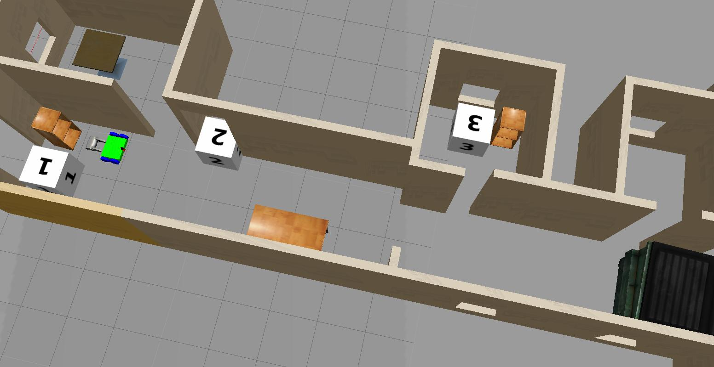
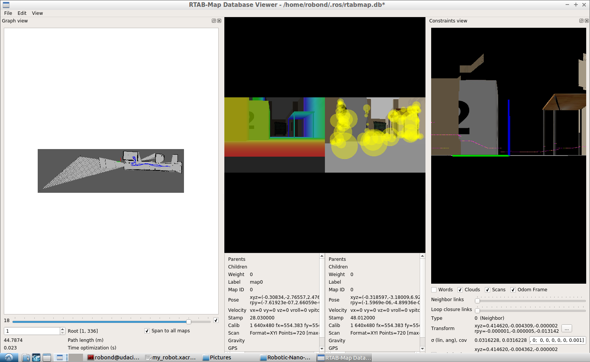

# Robotic-Nano-Degree-Project-4

## Description

- This is the fourth project of the Robotics udacity nano-degrees. 
- The robot is able to navigate the environment and draw 3d point clound and 2d occupency grid maps using rtabmap ros package.

## Prerequistes

- Udacity Robond virtual machine running on VMWare Player

## Building

```shell
# Create the workspace
mkdir -p ~/catkin_ws/src
cd  ~/catkin_ws/src
# Clonning the Repo
git clone git@github.com:RemonComputer/Robotic-Nano-Degree-Project-4.git 
cd ..
# Compiling the packages
catkin_make
```

## Running

- Open the first terminal to launch the robot package (and launch the robot in the simulation & Rviz). 
```shell
cd ~/catkin_ws
source ~/catkin_ws/devel/setup.bash
roslaunch my_robot world.launch
```

- Open another terminal to run the mapping node
```shell
cd ~/catkin_ws
source ~/catkin_ws/devel/setup.bash
roslaunch my_robot mapping.launch
```

- Open another terminal and run the keyboard_teleop_package
```shell
cd ~/catkin_ws
source ~/catkin_ws/devel/setup.bash
roslaunch my_robot teleop.launch
```

## What to expect

- Slowly take a tour in the environment and make closed cycles, you will notice that the grid map is being drawn along with some loop closure constrains is been detected.
- After taking a tour you will notice that your map is saved to `~/.ros/rtabmap.db`
- You can examine this map database using `rtabmap-databaseViewer ~/.ros/rtabmap.db`
- Here is the [rtabmap.db](https://drive.google.com/file/d/1zd5HTKqgdSvC0AL5GF3FqX6vkxNklt7w/view?usp=sharing) database so you can examine it.

## Screenshots

||
|:--:|
|<b>figure 1: Updated robot and environment</b>|
|:--:|
||
|<b>figure 2: RTabmap Database viewer showing samples from the resulted database.</b>|
