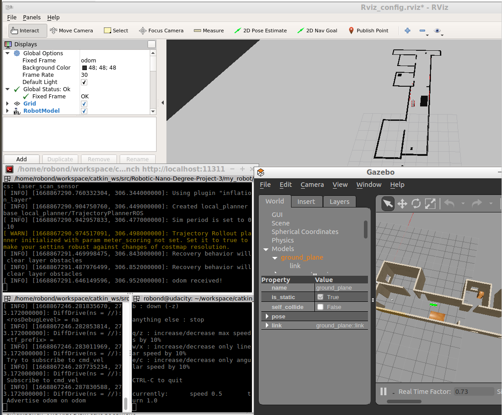

# Robotic-Nano-Degree-Project-3

## Description

- This is the third project of the Robotics udacity nano-degrees. 
- The robot would be able to localize its position on the mapusing its surroundings.

## Prerequistes

- Udacity Robond virtual machine running on VMWare Player

## Building

```shell
# Create the workspace
mkdir -p ~/catkin_ws/src
cd  ~/catkin_ws/src
# Clonning the Repo
git clone git@github.com:RemonComputer/Robotic-Nano-Degree-Project-3.git 
cd ..
# Compiling the packages
catkin_make
```

## Running

- Open the first terminal to launch the robot package (and launch the robot in the simulation & Rviz). 
```shell
cd ~/catkin_ws
source ~/catkin_ws/devel/setup.bash
roslaunch my_robot world.launch
```

- Open another terminal to run the Adaptive monte carlo localization algorithm.
```shell
cd ~/catkin_ws
source ~/catkin_ws/devel/setup.bash
roslaunch my_robot amcl.launch
```

- Open another terminal and run the keyboard_teleop_package
```shell
cd ~/catkin_ws
source ~/catkin_ws/devel/setup.bash
rosrun teleop_twist_keyboard teleop_twist_keyboard.py
```

## What to expect

- Walk a few steps forward and you will notice that the robot is able to localize itself perfectly  as shown in the screenshot

## Screenshots


